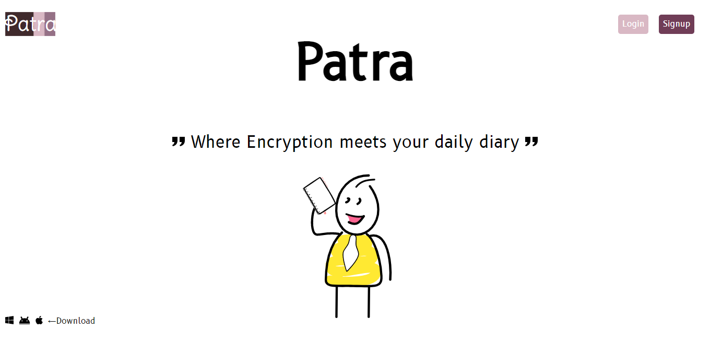

<br/>
<br/>
# Patra
 An online Journal for everyone
 
 # How To set up project
 
Install Laravel
```
composer global require laravel/installer
 ```
clone Git<br>
go inside project 
```
php artisan migrate
php artisan serve
```

 
# ` Home Page`
<br/>


# ` Login Page`
<br/>

# ` SignUp Page`
<br/>

# ` Change NoteBook Cover Page`
<br/>


# ` Change NoteBook Cover Color`
<br/>


# ` Custom NoteBook Cover Maker`
<br/>

# ` Read diary`
<br/>

# ` Write diary`
<br/>


`Enjoy messing around with it!!`
